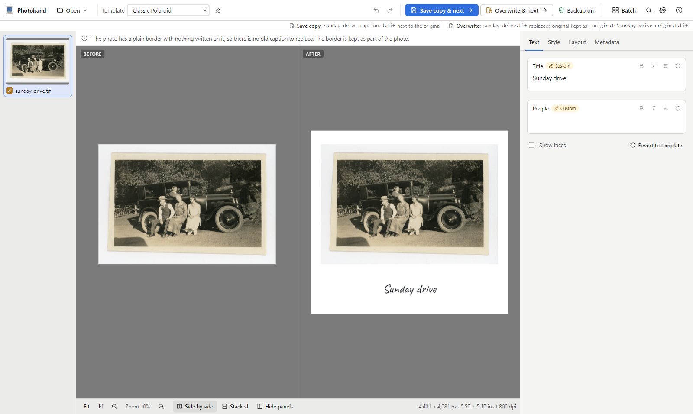

# Photoband

**Add a Polaroid-style caption band to your scanned photos.** Photoband reads the title, date, place and the names of the people in each photo from its own metadata, writes them neatly under the picture, and keeps the photo itself untouched.

<picture>
  <source media="(prefers-color-scheme: dark)" srcset="docs/images/editor-dark.png">
  
</picture>

- **What you see is what you get.** The preview is pixel-for-pixel what gets saved.
- **Your originals are safe.** *Save copy* never touches the original. *Overwrite* keeps a backup first.
- **Built for archives.** 8 and 16-bit TIFF, JPEG and PNG. Photo pixels are never resampled, and all metadata (including face tags) is carried over.
- **One photo or a thousand.** Caption a folder in one go with Batch.

## Install

| Your computer | Download | Then |
|---|---|---|
| **Windows 10 or 11** | `PhotobandSetup-<version>.exe` | Run it. No administrator password needed. |
| **Mac with Apple silicon** (M1 and newer) | `Photoband-<version>-macos-arm64.dmg` | Open it and drag Photoband to Applications. |
| **Mac with Intel** | `Photoband-<version>-macos-x86_64.dmg` | Open it and drag Photoband to Applications. |
| **Linux** | No installer yet | See [Run from source](#run-from-source). |

Get the files from the [**latest release**](../../releases/latest). Everything Photoband needs is included.

<details>
<summary>"Windows protected your PC" or "Apple cannot check it for malicious software"?</summary>

You will only see this if the release you downloaded is not code-signed.

- **Windows:** click **More info**, then **Run anyway**.
- **Mac:** in Finder, right-click (or Control-click) Photoband, choose **Open**, then **Open** again. You only need to do this once.

</details>

## Quick start

1. **Open your photos.** Click **Open folder…**, or drag a folder onto the window.
2. **Check the caption.** It is filled in from each photo's information. To change it, type in the box on the right or click the caption in the preview.
3. **Pick a look.** Choose a **Template** at the top, e.g. *Classic Polaroid* or *Museum card*. The *Style* and *Layout* tabs fine-tune it.
4. **Save.**
   - **Save copy & next** (`Ctrl+S` / `⌘S`) writes a new file next to the original, then opens the next photo.
   - **Overwrite & next** (`Ctrl+Shift+Enter` / `⌘⇧Enter`) replaces the file, keeping a backup in an `_originals` folder, then opens the next photo.
   - *Save copy as…* (`Ctrl+Shift+S`) and a copy without the hidden band data are in the command palette (`Ctrl+K`).
5. **Many photos?** Click **Batch**. Then choose the photos, let Photoband check them, and save them all at once. *Restore originals* undoes an overwrite batch.

**Tips**

- Hover over anything to see what it does.
- Press `Ctrl+K` / `⌘K` to search every command.
- `F1` lists all keyboard shortcuts.
- Your edits are kept as drafts until you save, so closing the app or switching photos never loses work.
- If a photo already has a caption band (from Photoband or another app), Photoband offers to edit or replace it instead of adding a second one.
- **Help › Getting started** walks through all of this inside the app.

## Run from source

For Linux, or if you'd rather not use an installer. You need [Python 3.11+](https://www.python.org/downloads/), [Node.js 22.12+](https://nodejs.org/) and [ExifTool](https://exiftool.org/).

```bash
git clone https://github.com/<you>/photoband.git
cd photoband
python3 scripts/bootstrap.py          # Windows: py scripts\bootstrap.py
```

Install ExifTool with your package manager:

| OS | Command |
|---|---|
| Linux | `sudo apt install libimage-exiftool-perl` |
| macOS | `brew install exiftool` |
| Windows | `winget install OliverBetz.ExifTool` |

The bootstrap script sets everything up in a `.venv` folder and prints how to start the app:

```bash
.venv/bin/photoband serve        # opens Photoband in your web browser (best on Linux)
.venv/bin/photoband              # opens Photoband in its own window (Windows and macOS)
```

On Windows, use `.venv\Scripts\photoband` instead of `.venv/bin/photoband`.

## Help and feedback

- Something went wrong? The app's log is in its data folder:
  - Windows: `%APPDATA%\Photoband\logs`
  - Mac: `~/Library/Application Support/Photoband/logs`
  - Linux: `~/.local/share/Photoband/logs`
- Report problems on the [issue tracker](../../issues) and attach `photoband.log`.
- Developers: see [CONTRIBUTING.md](CONTRIBUTING.md) for setup, tests, packaging and architecture.

## License

[MIT](LICENSE). Bundled components (ExifTool, fonts and libraries) keep their own licenses; see [THIRD_PARTY_NOTICES.md](THIRD_PARTY_NOTICES.md).
